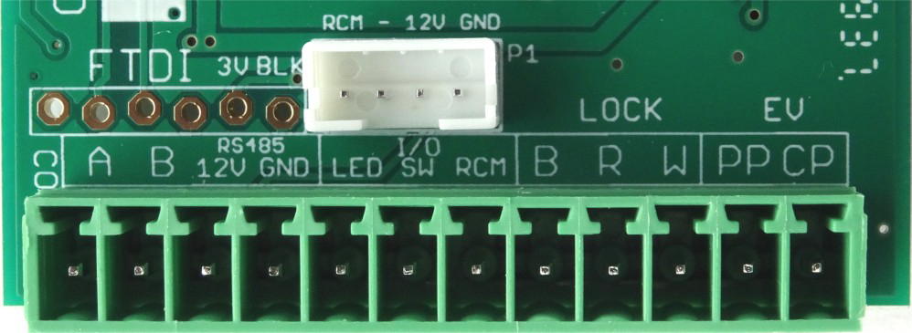
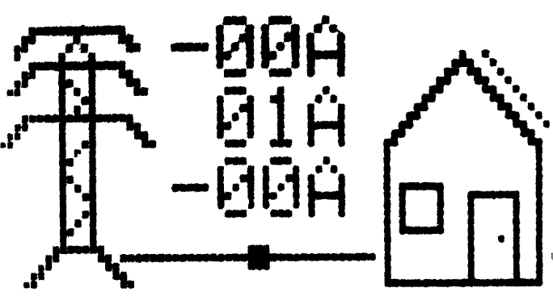

# Sensorbox 2 Installation and User Manual

## Description

The **Sensorbox 2** measures current (including its direction) on 1 to 3 phases and transmits this information to the SmartEVSE controller. This enables smart charging for electric vehicles (EVs), adjusting power based on the household load and solar energy generation. When other appliances are switched on, power to the EV automatically reduces. The system also allows solar power charging, ensuring efficient use of solar energy.

### Supported Meters

To measure current, use current clamps or connect via the P1-port of a compatible DSMR5 smart meter. The P1 ports of following meters have been tested and are compatible with Sensorbox 2:

- **Iskra**
  - AM550-TD2 (E0054... / E0066...)
- **Landis+Gyr**
  - E360 (E0051... / E0052... / E0067...)
- **Kaifa**
  - MA304H4CNL (E0056... / E0060...)
  - MA304 SMR 5.5 (E0079...)
- **Sagemcom**
  - T210-D ESMR5 (E0048...)
  - T211 ESMR5 (E0062...)

---

## Safety Instructions

> :warning: **Important!** Read all instructions carefully before installing or using the Sensorbox or SmartEVSE.  
> :warning: **Warning!** Installation, operation, and maintenance should only be carried out by qualified electricians.  
> :warning: **Attention!** Before installation, ensure no mains voltage is present using a voltage measuring device.

---

## Installation

### 1. Connecting the CTs (Without Smart Meter or with Incompatible Smart Meter )

1. **CT Placement:**  
   Place the current transformers (CTs) around the phase wires after they exit the main electricity meter. Ensure all CTs are oriented in the same direction.
   
2. **Voltage Input:**  
   Connect the voltage input to the same phase as CT1 using the provided mains cable.

3. **CT to Sensorbox:**  
   Connect the CTs to the corresponding ports on the Sensorbox:
   - CT for L1 to port 1
   - CT for L2 to port 2
   - CT for L3 to port 3

> :warning: The voltage input (MAINS) **must** be connected to the same phase as CT1.

### 2. Connecting to the SmartEVSE

Use a 4-wire cable to connect the Sensorbox to the SmartEVSE, which will also power the Sensorbox.

- A **CAT5 cable** can be used for this connection (up to 100 meters).
- On the Sensorbox side, connect the wires to the green 4-position pluggable screw terminal provided with the Sensorbox.
- On the SmartEVSE side, connect the wires to the green 12-position screw terminal provided with the SmartEVSE.
- Ensure a straight connection:
  - A to A
  - B to B
  - 12V to 12V
  - GND to GND

### 3. Connecting to a Smart Meter (P1-port)

If a DSMR5 smart meter is installed, connect it to the Sensorbox using the supplied RJ12 cable.

> :warning: Only use the supplied RJ12 cable, which has a [reverse pinout](https://www.showmecables.com/media/wysiwyg/pinout_2.png). Many other P1 cables have a [straight pinout](https://www.showmecables.com/media/wysiwyg/pinout_2.png), which will not work correctly in combination with the SensorBox 2.

---

## Testing and Configuration

1. **Set Up SmartEVSE:**
   - Set the mode to **SMART** or **SOLAR**.
   - Ensure the **MAINSMET** option is set to **Sensorbox**.

2. **Select Grid Connection Type:**
   - For a 3-phase star connection with neutral (e.g., the Netherlands), select **4Wire**.
   - For delta grids (e.g., Belgium or Norway), select **3Wire**.

Once configured, the measured currents for L1, L2, and L3 should appear on the display. Negative values indicate power is being sent back to the grid.

---

## Troubleshooting

### Incorrect Measurements

- If negative values are displayed without actual feedback to the grid, reverse the MAINS plug on the Sensorbox.

### Wrong Order of L1, L2, L3

- If the displayed values are incorrect, check the order of the CT connections on the Sensorbox. The current for L1 should be displayed correctly, with the voltage input connected to the same phase. If the readings for L2 and L3 are swapped, try swapping the CT connections for ports 2 and 3.

---

## Status LED

- **Green Light:** Indicates feedback to the grid.
- **Orange Light:** Indicates drawing power from the grid.
- **Red Light:** No measurements are being made.

When connected to a smart meter, the status LED briefly lights up green every 2 seconds. If it lights up orange, the meter may be outdated or unsupported. When using CT inputs, the LED will blink for each phase.

---

## Program Port

The program port is used to update the Sensorbox software. For more information on updates, refer to the main [GitHub page](../README.md).

---

## Contact Information

Designed and manufactured in The Netherlands by **Stegen Electronics**.

**Address:**  
Westeinde 15, 1606 CZ Venhuizen, The Netherlands

**Website:**  
[www.stegen.com](http://www.stegen.com)  
**Phone:**  
+31 228 8512 19
